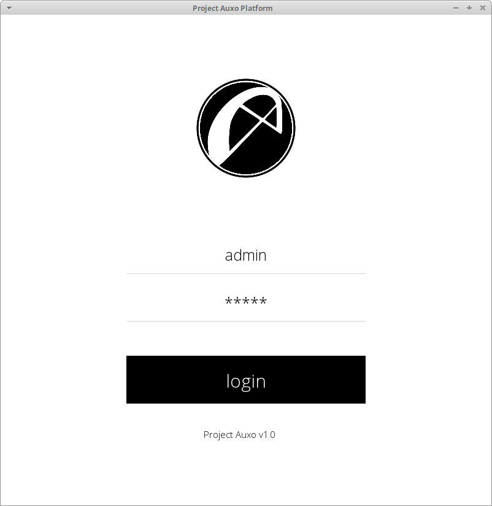
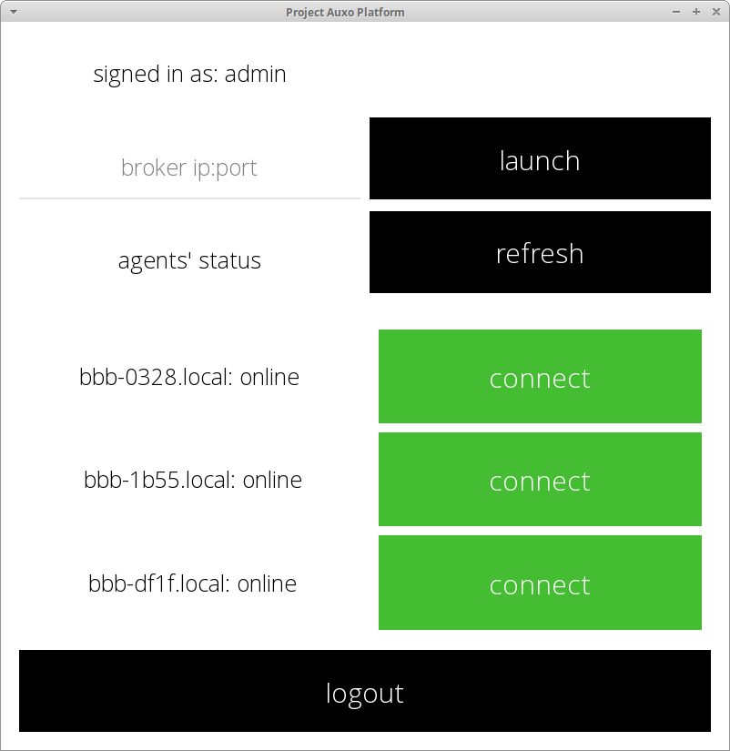

#  Auxo

Project Auxo GUI for launching the Olympus broker and dispatching the Apollo agents 

Flat theme inspired by [Flat UI](http://designmodo.github.io/Flat-UI/)





## Setup

### 1. Download

- _Download_ the zip archive 

- _Unzip_ the archive

### 2. Install requirements
Make sure to pip install into a python virtualenv!
```bash
 pip3 install -r requirements.txt
```